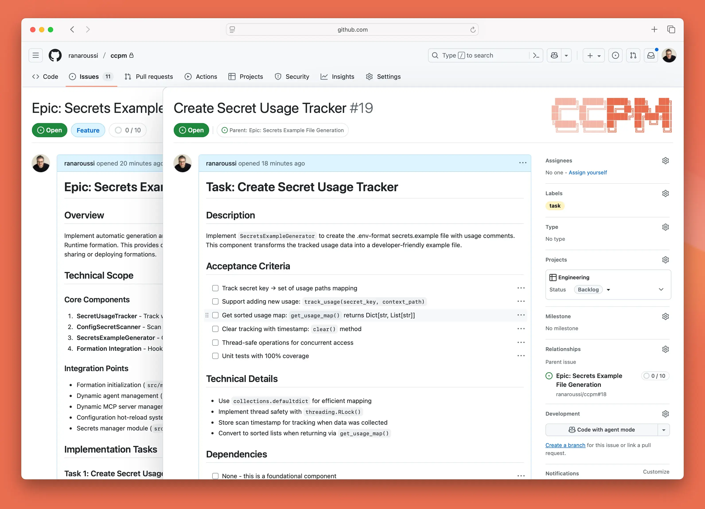

# CCPM – The Project Manager Skill

[](https://agentskills.io)
[](https://github.com/visualjc/ccpm)
[](LICENSE)
[](https://github.com/visualjc/ccpm)

Spec-driven development for AI agents: PRDs, epics, GitHub issues, durable context, and validation workflows in one cross-harness skill.

This fork rebases onto upstream's single `skill/ccpm/` layout and keeps fork-specific behavior additive: multi-harness installers, migration docs, context workflows, and testing workflows.



## What It Does

CCPM gives your agent a repo-backed delivery workflow:
- plan features as PRDs
- turn PRDs into technical epics and tasks
- sync work to GitHub issues
- launch and coordinate parallel implementation
- track status through deterministic scripts
- preserve project context in `.claude/context/`
- detect and run tests through `.claude/testing-config.md`

The installed skill location is harness-specific. Planning artifacts live under `docs/prds/` by default, while CCPM config/context/testing state lives under `.claude/` at the project root.

## Install

Install from a clone with the project-local installer:

```bash
git clone https://github.com/visualjc/ccpm.git
cd ccpm
./project-install.sh /path/to/project --target claude
```

Supported targets:
- `claude` -> `.claude/skills/ccpm`
- `cursor` -> `.cursor/skills/ccpm`
- `codex` -> `skills/ccpm`
- `openclaw` -> `skills/ccpm`
- `all` -> all of the above

Examples:

```bash
./project-install.sh . --target cursor
./project-install.sh . --target codex
./project-install.sh . --target all
```

Bootstrap installers:
- Unix/macOS: [install/ccpm.sh](install/ccpm.sh)
- Windows: [install/ccpm.bat](install/ccpm.bat)

See [install/README.md](install/README.md) for details.

## Usage

Use the `ccpm` skill through natural language or `/ccpm` where your harness exposes skill commands.

Common prompts:

| What you say | What CCPM does |
|---|---|
| "I want to build X" | guided brainstorming + PRD creation |
| "parse the X PRD" | PRD -> technical epic |
| "break down the X epic" | task decomposition |
| "sync the X epic to GitHub" | issue creation + local sync |
| "start working on issue 42" | analysis + parallel execution |
| "what's our status" / "standup" | run deterministic status scripts |
| "what should I work on next" | show next ready work |
| "create project context" | build `.claude/context/` |
| "update project context" | refresh context surgically |
| "prime context" | load context into a new session |
| "figure out the test setup" | create `.claude/testing-config.md` |
| "run tests for path/to/test" | run targeted tests with logs |

## Skill Layout

```text
skill/ccpm/
├── SKILL.md
└── references/
    ├── conventions.md
    ├── plan.md
    ├── structure.md
    ├── sync.md
    ├── execute.md
    ├── track.md
    ├── context.md
    ├── testing.md
    └── scripts/
        ├── status.sh
        ├── standup.sh
        ├── next.sh
        ├── blocked.sh
        ├── validate.sh
        ├── test-and-log.sh
        └── ...
```

Project data layout:

```text
docs/prds/
└── <prd-name>/
    ├── prd.md
    └── epics/
        └── <epic-name>/
            ├── epic.md
            ├── issues/
            ├── updates/
            └── github-mapping.md

.claude/
├── .ccpmrc
├── context/
└── testing-config.md
```

## Migration

This fork retires the old `/pm:*` payload model in favor of the single installed skill.

See:
- [MIGRATION.md](MIGRATION.md)
- [UPSTREAM_SYNC.md](UPSTREAM_SYNC.md)

For older repos with `.claude/prds` and `.claude/epics`, run:

```bash
bash skill/ccpm/references/scripts/migrate-layout.sh
```

Review the dry-run output, then apply the migration:

```bash
bash skill/ccpm/references/scripts/migrate-layout.sh --apply
```

The pre-migration layout is preserved locally via:
- tag: `legacy-pre-skills-layout`
- branch: `codex/legacy-pre-skills-layout`

## Validation

Run the installer smoke test from this repo:

```bash
bash install/validate-skills-install.sh
```

This validates install paths and skill file layout for `claude`, `cursor`, `codex`, `openclaw`, and `all`.

## Upstream

This fork tracks the upstream skills-first repo at [automazeio/ccpm](https://github.com/automazeio/ccpm). The goal is to keep the upstream structure intact and keep fork-specific changes additive and easy to reapply.
